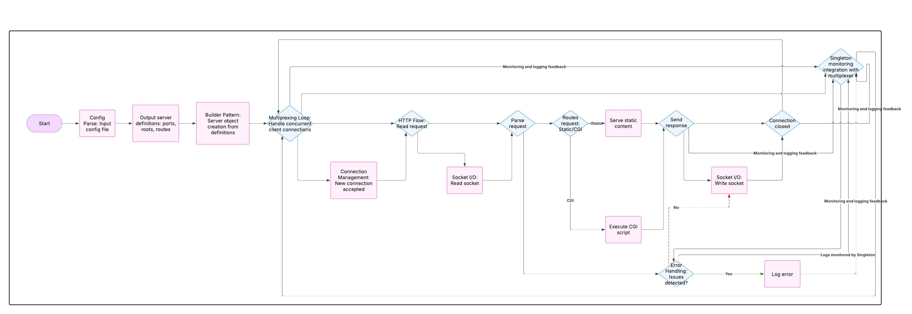

# Webserv : http server in c++ 98 from scratch

This program was developed by the **Abdellah, Anas and Nourddin** and covers multiple key aspects of network programming, including:
- HTTP request and response handling
- Multiplexed I/O operations
- File upload and deletion
- Support for various HTTP methods




# How to Use This Program

## Getting Started

1. **Clone the repository:**

   ```bash
   git clone git@github.com:nourddine-benyahya/webserv.git webserv
   cd webserv
   ```

2. **Build and run the program using Docker Compose:**

   ```sh
   make
   ```

   - This command will start the application on port **80**.
   - Wait for the process to complete.

3. **Access the program:**

   - Open your browser and go to `http://localhost:80`.

3. **Check the logs:**

   ```sh
   make logs
   ```

## Customization

If you want to change the ports or serve your static website, you can modify the default.conf file and update the Docker service to serve the necessary ports.

## Stopping and Cleaning Up

- **Stop the running Docker containers:**

  ```sh
  make stop
  ```

- **Remove the Docker images:**

  ```sh
  make rmi
  ```

- **Remove object files from the program:**

  ```sh
  make fclean
  ```

## Documentation

- **Socket Documentation:** Located inside the `server` folder.
- **HTTP Documentation:** Found inside the `request` and `response` folders.

---

For more details, check the relevant documentation files in the repository.

